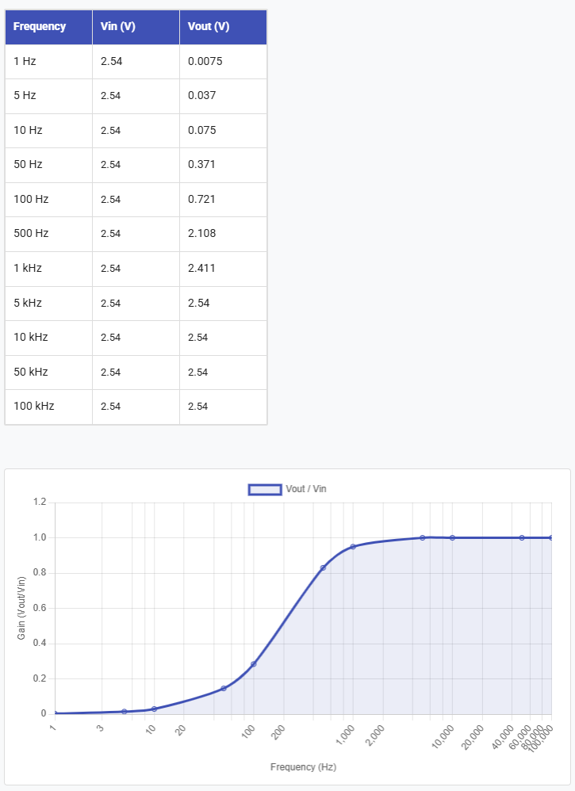

# Part 1 - Resistors, capacitors, and recording fundamentals 

## Voltage divider

**Exercise 1-1** 

- What is $V_{out}$?

Ans: 2.5V

- Change $R_{2}$ to a resistor with a lower value, e.g. $300\ Ohm$. What is $V_{out\ }$now?

Ans: 0.23 V

## Using the oscilloscope to measure signals

**Exercise 1-2** 

What is the voltage level shown on the screen? Does it match your multimeter measurement from Exercise 1-1?

Ans: The same as they had in the last exercise.

## Floating Inputs

**Exercise 1-3**

Connect an oscilloscope probe to **Channel 1** of your oscilloscope. Leave the other end of the wire completely disconnected (floating in the air). Set the oscilloscope scale to a sensitive vertical range (e.g., $50\,\text{mV/div}$ or $100\,\text{mV/div}$).

- What do you see? Why? What happens if you shake the wire around?

Ans: noisy b/c it is not grounded, more noisy when wire is shaken.

Connect the ground of the oscilloscope (the tiny crocodile clamp) to the signal input on the same channel.

- What happens to the noise? Why? What happens when you move the probe?

Ans: noise goes away b/c grounded.

## Generating signals with the oscilloscope

## Electrode Model

**Exercise 1-6** 

First, add $R_{s} = 10\text{ kOhm}$ to the breadboard. Before completing the circuit, use two oscilloscope probes along with the second channel on the oscilloscope to measure the input voltage and $V_{out}$ after 'electrode series resistance' $R_{s}$. How do the two voltage measurements compare?

Ans: Vin (set by default by the oscilloscope function generator) = 2.5 Vpp
The V after the electrode is the same because we are closing the circuit with a large impedance.

Next, complete your electrode model by adding $R_{sh} = 220\text{ Ohm}$ to the circuit. Using two oscilloscope probes, measure the voltage before and after the 'electrode' ($V_{out}$ and the function generator output). How much is the signal attenuated when measured?

Ans: 0.0215 * Vin

(220 / (10000+220) ) * Vin

# Part 2 - Passive filters

## Capacitor charge and discharge

**Exercise 2-1** 

Measure the voltage across the capacitor using the oscilloscope. What is it?

Ans: 5 V. It matches the voltage source.

With your probes attached to the circuit, disconnect the lead from +5V to the circuit.

- What happens to the LED?

Ans: after a while, once the charge from the capacitor runs out, the LED turns off.

- What happens to the voltage on the scope? Why? (Hint: there is a first and second-order answer to this question, a full explanation requires considering the LEDs I/V characteristics which you can look into if you want :)

Ans: It might decay if it is dimmable. If not, it switches off at a minimum voltage level.

**Capacitors and filters:**

**Question:** Which one do you think is a high pass filter (allows
higher frequencies to pass to the output) and which one is a low pass
filter? (consider 2 extreme cases of very high and zero input
frequencies)

Ans:
Top: low-pass
Bottom: high-pass

**Exercise 2-2:** 

- What happens to the amplitude of the output as the input frequency
  varies?

Ans: The amplitude gets less and less attenuated as the frequency increases
Cutoff: 1/(2*pi*0.00000047*1000) = 338 Hz

{: style="width: 4.921875546806649in; height: 3.69538823272091in; display: block; margin: 0 auto;" }

In the simulator: https://tinyurl.com/2chxk3ym

**Exercise 2-3:** Feed a 400 Hz sinusoidal signal to your circuit, and
visualize the input and output of the high pass filter with 2
oscilloscope probes. Do you notice any difference between input and
output signals other than the amplitude?

Ans: phase shifts

Filters, in addition to modulating the amplitude of signals, produce a
lag, causing the phase of the output signal to be shifted from the
input.

Change the input frequency to 1000 Hz, does the phase lag change?

Ans: the phase lag at the cutoff is 45 degrees (1/8th of a cycle). After the cutoff, there is no lag. At frequencies lower than the cutoff there is larger lag, with the output leading the input.

**Exercise 2-4:** Assemble a **low pas**s filter:

What happens to the amplitude and phase of the output as the input
frequency varies?

Ans: The amplitude gets less and less attenuated as the frequency increases
Cutoff: 1/(2*pi*220000*0.00000000056) = 1291 Hz

## Generate a frequency sweep with a PicoScope

**Exercise 2-5:** Connect the output of the PicoScope "AWG" to your
oscilloscope and look at the raw signal as well as at the Fourier
transform (FFT). What is the FFT doing? Connect the input to your filter
circuit and look at the output. Does it all make sense?

**Exercise 2-6:** So far we have been recording sine waves. Square waves
consist of a broad range of frequencies, with edges containing high
frequencies. Produce a square wave with your scope's function generator
and then use the scope to measure the signal before and after the
filter.

In the simulator: https://tinyurl.com/24tnmerk

- What do you observe?

Ans: the low-pass filter smoothes the rising and falling edges of the square pulse, which are the parts of the signal that have high frequency. 

- Turn on the FFT function on each of your scopes' inputs (CONF button).
  What do you see? (Hint: if you don't see anything interesting, try
  changing the bandwidth of your measurement using the horizontal
  controls on your scope.)

Ans: For the square wave, in the FFT you see a low frequency peak corresponding to the period of the wave, plus some high frequency components. Once it is filtered, the high frequency components in the FFT go away. 